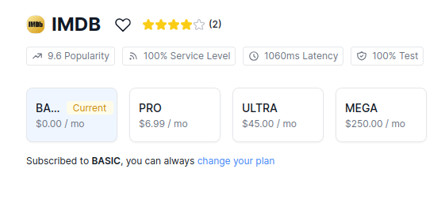

# week-hs-react-i

React II week project I

## Dev

Install the packages with node. 

```shell
npm install
```

Change the API KEY in a new local configuration file

```shell
echo "API_KEY=<your token>" > .env.local
```

this project uses [RapidAPi](https://rapidapi.com), specifically [IMDB API](https://rapidapi.com/DataCrawler/api/imdb188). Login in RapidAPI and subscribe to the free plan for IMDB, then put the api-key-token in the above command :)




### Run

```shell
npm run dev
```